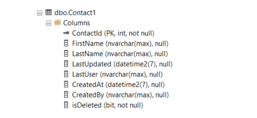

# EF Core Global Query Filters


## Learn how to 

- Create [global query filters](https://learn.microsoft.com/en-us/ef/core/querying/filters#disabling-filters) which are LINQ query predicates applied to Entity Types, in this article, your models. A typical example, using soft delete, only show those records which are active which will be gone over in code.
- Override global query filters [see also](https://learn.microsoft.com/en-us/ef/core/querying/filters#disabling-filters)
- Override a DbContext SaveChangesAsync and SaveChanges to handle soft deletes.
- Create an Excel file using [SpreadSheetLight](https://spreadsheetlight.com/) with [NuGet package](https://www.nuget.org/packages/SpreadsheetLight/3.5.0?_src=template).
    - I included SpreadSheetLight chm file outside the solution under folder SpreadSheetLightHelp as some may find if hard to get from SpreadSheetLight site.
- Using [FastMember.NetCore](https://www.nuget.org/packages/FastMember.NetCore/1.1.0?_src=template) to create a DataTable from a generic List for use with creating an Excel file.


## Limitations

Filters can only be defined for the root Entity Type of an inheritance hierarchy.

## Core Projects

- ShadowProperties, class project for data operations
- HasQueryFilterRazorApp, Razor Pages project which
    - Presents data
    - Provides an interface to soft delete records
    - Provides an interface to un-delete soft deletes.

## Windows forms projects

There are two projects, Backend and DemoShadowProperties. These are from the following Microsoft TechNet article [Entity Framework Core shadow properties (C#)](https://social.technet.microsoft.com/wiki/contents/articles/53662.entity-framework-core-shadow-properties-c.aspx) which were done with .NET Framework 4.7 and have been updated to 4.8.

The Core projects were based off these projects which shows when writing decent code a we have a good start to port to ASP.NET Core and Razor Pages.

## Database

Schema for the table used to demonstrate using global query filters.



### Columns

- **isDeleted** soft delete flag
- **CreatedBy** user which added the record
- **CreatedAt** when the record was added date time
- **LastUser** user to last modify a record
- **LastUpdated** last updated date time

### SQL to examine data in SSMS

```sql
SELECT ContactId,
       FirstName,
       LastName,
       LastUser,
       CreatedBy,
	   FORMAT(CreatedAt, 'MM/dd/yyyy') AS CreatedAt,
	   FORMAT(LastUpdated, 'MM/dd/yyyy') AS LastUpdated,
       IIF(isDeleted = 'TRUE' , 'Y','N') AS Deleted
FROM dbo.Contact1;
```

## Setup a global query filter

In the DbContext OnModelCreating method, after the entities have been configured add.

```csharp
modelBuilder.Entity<Contact>()
    .HasQueryFilter(contact =>
        EF.Property<bool>(contact, "isDeleted") 
        == false);
```

That's it. In the Index page to get contacts.

### Read filtered records

```csharp
public async Task OnGetAsync()
{

    if (_context.Contacts != null)
    {
        Contacts = await _context.Contacts.ToListAsync();
    }
}
```

Generated SQL, note the WHERE clause.

```csharp
SELECT [c].[ContactId], [c].[CreatedAt], [c].[CreatedBy], [c].[FirstName], [c].[LastName], [c].[LastUpdated], [c].[LastUser], [c].[isDeleted]
FROM [Contact1] AS [c]
WHERE [c].[isDeleted] = CAST(0 AS bit)
```

:stop_sign: did you notice in the database the table name is Contact1 but in the above code we are using Contact model. This is done via [Table name annotations](https://learn.microsoft.com/en-us/ef/core/modeling/entity-types?tabs=data-annotations#table-name).

```csharp
[Table("Contact1")]
public partial class Contact : INotifyPropertyChanged
```

### Ignore filters

[IgnoreQueryFilters extension](https://learn.microsoft.com/en-us/dotnet/api/microsoft.entityframeworkcore.entityframeworkqueryableextensions.ignorequeryfilters?view=efcore-7.0) Specifies that the current Entity Framework LINQ query should not have any model-level entity query filters applied.

```csharp
public async Task OnGetAsync()
{
    if (_context.Contacts != null)
    {
        Contacts = await _context
            .Contacts
            .IgnoreQueryFilters() // IMPORTANT
            .ToListAsync();
    }
}
```

## Handling soft deletes

Working in DeleteContactPage.

- An id is passed from the index page
- Find and validate the contact exists still
- Begin tracking the contact marked as deleted.

```csharp
public async Task<IActionResult> OnPostAsync(int? id)
{
    if (id == null || _context.Contacts == null)
    {
        return NotFound();
    }
    var contact = await _context.Contacts.FindAsync(id);

    if (contact != null)
    {
        Contact = contact;
        _context.Contacts.Remove(Contact);
        await _context.SaveChangesAsync();
    }

    return RedirectToPage("./Index");
}
```

Back in the DbContext we override SaveChangesAsync.

```csharp
public override Task<int> SaveChangesAsync(CancellationToken cancellationToken = new ())
{
    HandleChanges();
    return base.SaveChangesAsync(cancellationToken);
}
```

**HandleChanges method**

- Traverse entities, if the state is `EntityState.Deleted`, set its state to Modfied followed by setting `isDeleted` to `true`.

```csharp
private void HandleChanges()
{
    foreach (var entry in ChangeTracker.Entries())
    {
        // take care of date time created and updated
        if (entry.State is EntityState.Added or EntityState.Modified)
        {
            entry.Property("LastUpdated").CurrentValue = DateTime.Now;
            entry.Property("LastUser").CurrentValue = Environment.UserName;

            if (entry.Entity is Contact && entry.State == EntityState.Added)
            {
                entry.Property("CreatedAt").CurrentValue = DateTime.Now;
                entry.Property("CreatedBy").CurrentValue = Environment.UserName;
            }
        }
        else if (entry.State == EntityState.Deleted)
        {
            // Change state to modified and set delete flag
            entry.State = EntityState.Modified;
            entry.Property("isDeleted").CurrentValue = true;
        }
    }
}
```


## WCAG Accessibility

All pages conform to WCAG AA standard.

Note that the checkbox on the admin page needed aria-label attribute for screen readers to properly identify the checkbox purpose.

## Admin page

This page allows the user to perform deletions and un delete operations which are respected by the global in place.


## Soure code

Clone the following [GitHub repository](https://github.com/karenpayneoregon/efcore-shadow-properties)

## Next step

Is to work with an Interceptor and [interface](https://learn.microsoft.com/en-us/ef/core/logging-events-diagnostics/interceptors).

For this see [How to Implement a Soft Delete Strategy with Entity Framework Core](https://blog.jetbrains.com/dotnet/2023/06/14/how-to-implement-a-soft-delete-strategy-with-entity-framework-core/?utm_campaign=rider&utm_content=nonprod&utm_medium=referral&utm_source=twitter). Going this way is a personal choice and in this article moving in this direction will be easy as this code and mine are compatible.


